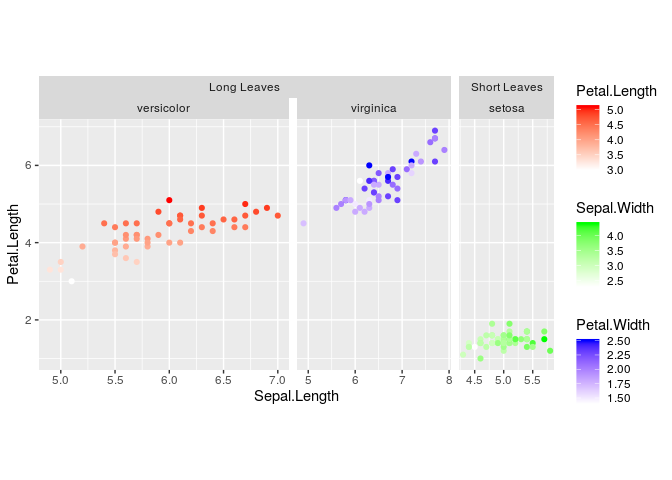
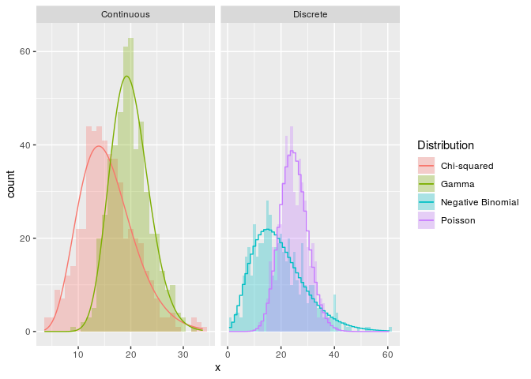
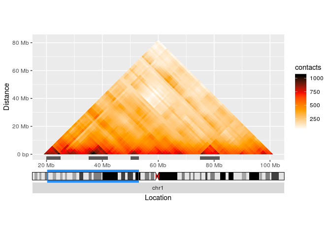

<!-- README.md is generated from README.Rmd. Please edit that file -->

# ggnomics 

<!-- badges: start -->

[](https://travis-ci.org/teunbrand/ggnomics)
[](https://codecov.io/gh/teunbrand/ggnomics?branch=master)
<!-- badges: end -->

This package was written to extend `ggplot2` with the following
philosophy:

1.  I couldn’t do something easily in vanilla ggplot2, so I wrote
    something to amend that.

In keeping with this, this package provides the function
`force_panelsize()` to force ggplot panels to adopt a specific ratio or
absolute dimension. It also provides `scale_fill/colour_multi()` and
`scale_listed()` to map multiple aesthetics to different colour scales.
Hierarchies in strip labels can be indicated by using `facet_nested()`,
which merges strip labels that span the same inner variables. To make
the handling of subsets of data as seperate geoms easier, it provides
`ggsubset()`.

Keeping in line with the name of the package, it provides functions such
as `facet_ideogrid()` and `facet_ideowrap()` which will put ideograms
with highlights next to facetted panels. Also the new Hi-C triangle geom
(`geom_hictriangle`) makes it easy to display Hi-C matrices from the
[GENOVA](https://github.com/robinweide/GENOVA) package in a 45° rotated
fashion. There are also a few other neat things, like the cousin of rug
plots `geom_rectrug()`, and `geom_genemodel` for when a genomic track or
matrix needs to be annotated.

There are still a few things I’m not mentioning here, but feel free to
take a look at the examples below.

Please keep in mind that this package is highly experimental, may be
unstable and is subject to changes in the future. Since this is my first
package out in the wild, constructive feedback is appreciated.

## Installation

You can install ggnomics from github with:

``` r
# install.packages("devtools")
devtools::install_github("teunbrand/ggnomics")
```

## Basic example

This is a basic example of `scale_colour_multi()`, `facet_nested()`,
`force_panelsizes()` and `ggsubset()` in action:

``` r
library(ggplot2)
library(ggnomics)

phi <- 2/(1 + sqrt(5))

df <- iris
df$nester <- ifelse(df$Species == "setosa",
                    "Short Leaves",
                    "Long Leaves")

g <- ggplot(df, aes(x = Sepal.Length, y = Petal.Length)) +
  geom_point(aes(sepal.width = Sepal.Width),
             ggsubset(Species == "setosa")) +
  geom_point(aes(petal.length = Petal.Length),
             ggsubset(Species == "versicolor")) +
  geom_point(aes(petal.width = Petal.Width),
             ggsubset(Species == "virginica")) +
  facet_nested(~ nester + Species, scales = "free") +
  scale_colour_multi(aesthetics = c("sepal.width", 
                                    "petal.length", 
                                    "petal.width"),
                     colours = list(c("white", "green"),
                                    c("white", "red"),
                                    c("white", "blue")),
                     guide = guide_colourbar(barheight = unit(50, "pt"))) +
  force_panelsizes(rows = 1, cols = c(1, phi, phi^2), respect = TRUE)
#> Warning: Ignoring unknown aesthetics: sepal.width
#> Warning: Ignoring unknown aesthetics: petal.length
#> Warning: Ignoring unknown aesthetics: petal.width
g
```

<!-- -->

The warning about ignoring unknown aesthetics can be circumvented by
updating the defaults of geoms,
e.g.:

``` r
ggplot2::update_geom_defaults("point", list(fill = c("sepal.width", "petal.length", "petal.width")))
```

## Statistics example

The question ‘how do I fit a XYZ-distribution to my data’ has become a
lot easier to answer for a variety of theoretical distributions with the
introduction of `stat_theodensity()` for maximum likihood estimation
through `fitdistrplus`. For when those kernel density estimates don’t
cut it
anymore.

``` r
# These examples have been chosen slightly deliberately since Chi-squared can be
# fitted by a Gamma distribution, just as Poisson can be fitted with a negative
# binomial.
set.seed(1)
df <- data.frame(
  x = c(rpois(500, 25), rnbinom(500, 5, 0.2), 
        rgamma(500, 30, 1.5), rchisq(500, 15)),
  class = rep(c("Discrete", "Continuous"), each = 1000),
  Distribution = rep(c("Poisson", "Negative Binomial", 
                       "Gamma", "Chi-squared"),
                     each = 500)
)

ggplot(df, aes(x, fill = Distribution, colour = Distribution)) +
  geom_histogram(position = "identity", binwidth = 1, 
                 alpha = 0.3, colour = NA) +
  stat_theodensity(aes(y = stat(count)), 
                   ggsubset(class == "Discrete"),
                   distri = "nbinom", geom = "step",
                   position = position_nudge(x = -0.5)) +
  stat_theodensity(aes(y = stat(count)), 
                   ggsubset(class == "Continuous"),
                   distri = "gamma") +
  facet_grid(~ class, scales = "free_x")
```

<!-- -->

## Hi-C example

Hi-C triangles from GENOVA experiment data can be plotted with
`geom_hictriangle()`, annotated with features in the margins with
`geom_rectrug()`, while ideograms can offer the genomic context through
`facet_ideogrid`.

``` r
# Generate some fake Hi-C data to plot
set.seed(0)
exp <- example_HiC()

# Define a region of interest through GRanges
roi <- GenomicRanges::GRanges(
  "chr1", IRanges::IRanges(20e6, 100e6)
)

# Some features that are not totally senseless with this particular seed
features <- data.frame(
  xmin = c(35, 75, 20, 50) * 1e6,
  xmax = c(42, 82, 25, 53) * 1e6
)

# Ideograms can be setup to use facet_ideo* functions.
setup_cytobands(example_cytobands(),
                example_cytoband_colours())

ggplot() +
  geom_hictriangle(exp, roi) +
  geom_rectrug(data = features,
               aes(xmin = xmin, xmax = xmax)) +
  coord_fixed(0.5) +
  scale_fill_gradientn(colours = c("white", "orange", "red", "black")) +
  scale_x_continuous("Location", 
                     labels = format_genco) +
  scale_y_continuous("Distance", 
                     labels = format_genco) +
  facet_ideogrid(~ "chr1", switch = "x", 
                 high.col = "dodgerblue", 
                 ideo.size = unit(0.05, "null")) +
  theme(strip.placement = "outside")
```

<!-- -->
